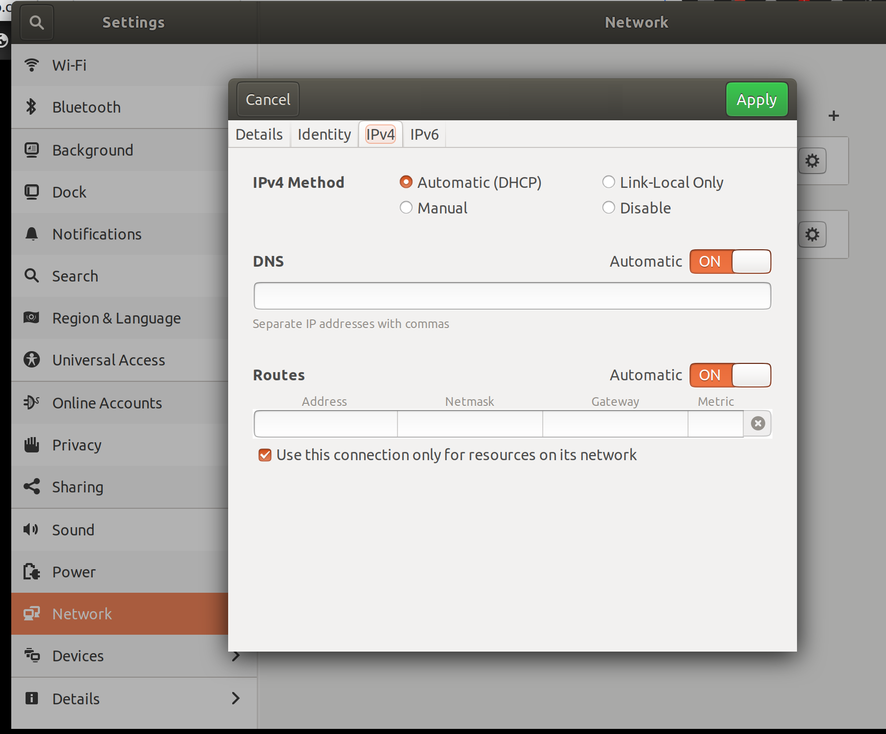

# Linux requirements

```
git clone http://github.com/joamatab/install_new_computer
cd install_new_computer
bash install.sh ubuntu.mk
```
- for fedora `bash install.sh fedora.mk`
- for arch `bash install.sh arch.mk`

References:

- [arch](https://github.com/Noah-Huppert/.dotfiles/wiki/System-Install)
- [xps ubuntu](https://gist.github.com/natbusa/932eaa9c0b4eb68a20c12b6087b376fd)


## VPN


install openvpn

- Ubuntu `sudo apt-get install openvpn`

then you import the file in settings, network, and make sure that you use the VPN only for the services that you need to


