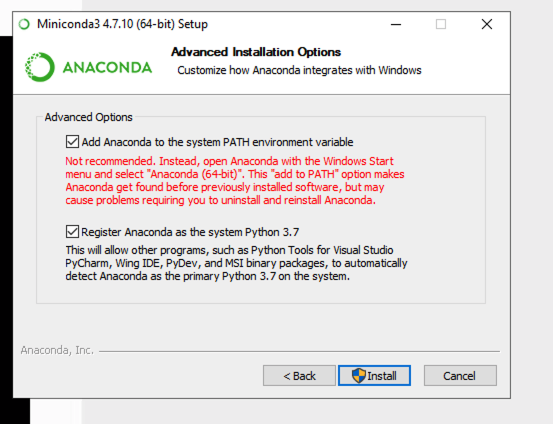
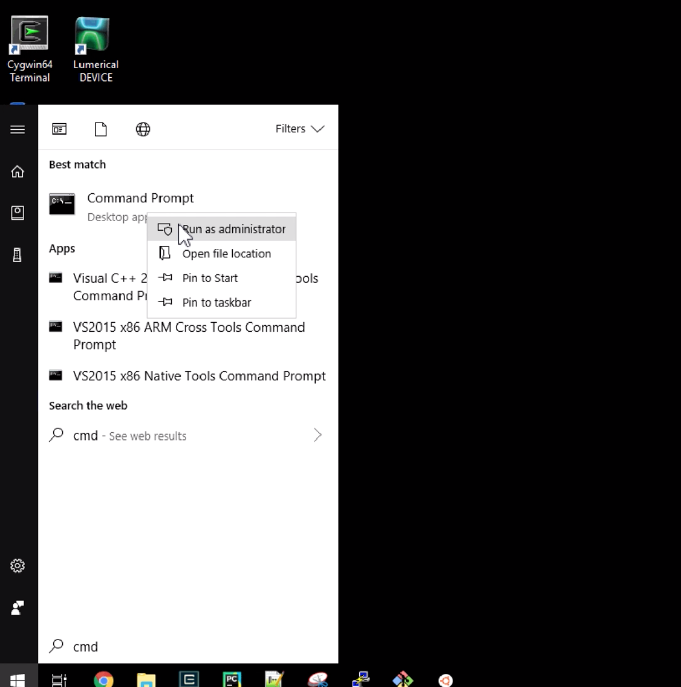
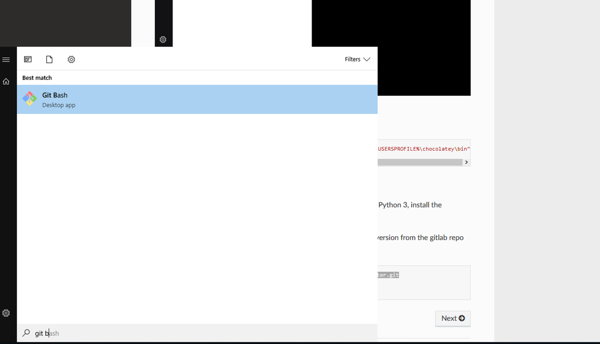

# Windows requirements

[you can watch this video](https://www.dropbox.com/s/mm66vhiq4dij2eh/git_for_windows.flv?dl=0)

Install python 3, GIT and Make:

- [miniconda3 for python3 64 bits](https://repo.anaconda.com/miniconda/Miniconda3-latest-Windows-x86_64.exe)
- [GIT for windows](https://gitforwindows.org/)
- make: we install a lot of packages using `make` and `Makefiles`. So I recommend that you install chocolatey
- you need to login to [gitlab](http://gitlab.com/) or [github](http://github.com/)

## Install python3 64 bits

Make sure you add python to the path



## Install GIT for windows

[GIT for windows](https://gitforwindows.org/)

## Install chocolatey

Open a terminal as administrator, by start typing `cmd` in the windows bar and right click to `Run as administrator`



Then copy paste this long line into the terminal

```
@"%SystemRoot%\System32\WindowsPowerShell\v1.0\powershell.exe" -NoProfile -InputFormat None -ExecutionPolicy Bypass -Command "iex ((New-Object System.Net.WebClient).DownloadString('https://chocolatey.org/install.ps1'))" && SET "PATH=%PATH%;%ALLUSERSPROFILE%\chocolatey\bin"
```

then run `choco install make` inside the terminal

next you will need to open Git Bash



Once you have `git` and `python3` we recommend to install the latest version from the gitlab repo by copy-pasting this 3 lines into a Git Bash terminal.

```
git clone http://github.com/joamatab/install_new_computer
cd install_new_computer
bash install.sh
```

If you are on Windows, you will need a C++ compiler - For Windows + Python 3, install the Microsoft ["Build Tools for Visual Studio"](https://www.visualstudio.com/downloads/#build-tools-for-visual-studio-2017)
