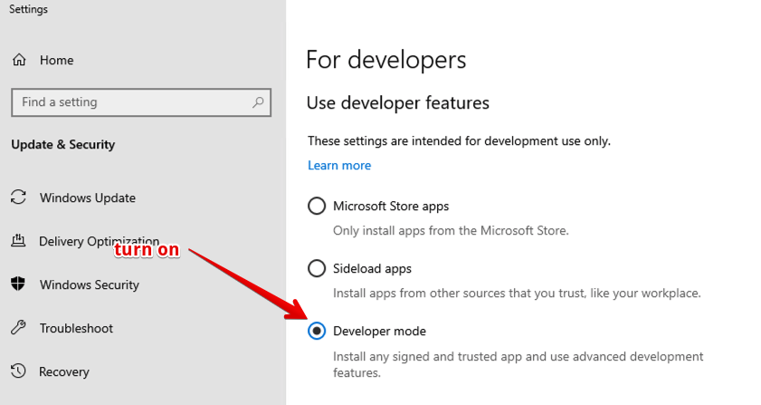
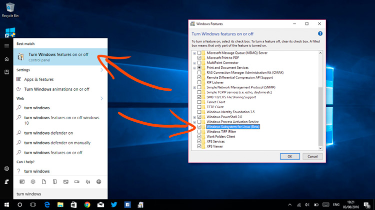
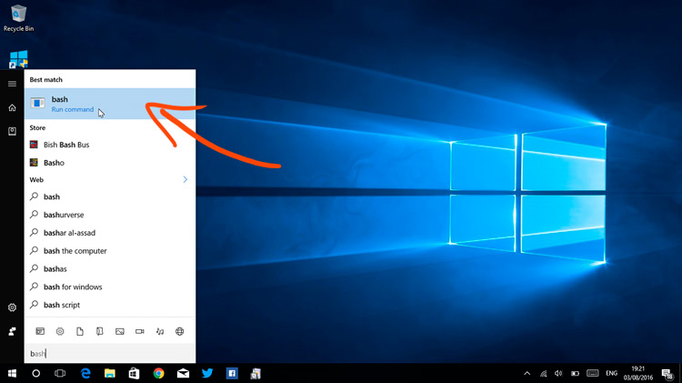
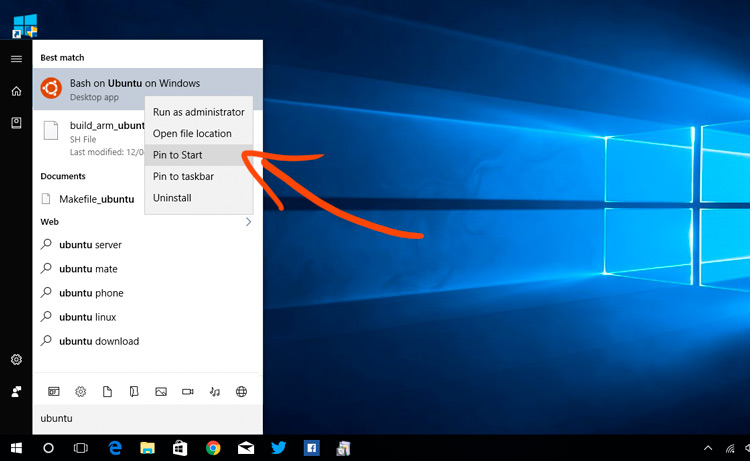

# Ubuntu inside windows

1. If you want to play with features aimed at developers you gotta enable developer mode first. To do this on Windows go to Settings > Update & Security > For Developers > Developer Mode.

2. Enable Windows Subsystem for Linux

3. Reboot!

4. Open ‘Bash’
   When you’re back, open the Start Menu and search for ‘Bash’. Click on the icon that appears.

5. Open ‘Ubuntu’

References:

- [link](https://www.omgubuntu.co.uk/2016/08/enable-bash-windows-10-anniversary-update)
